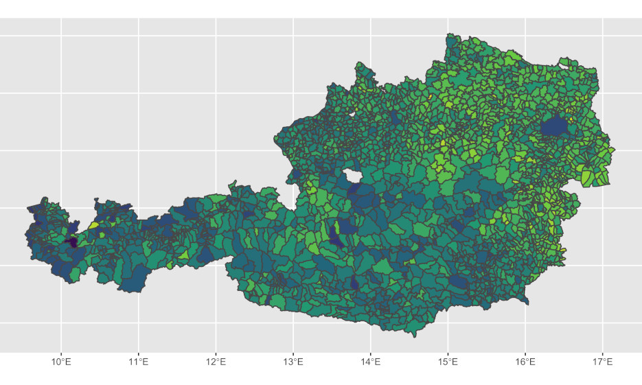
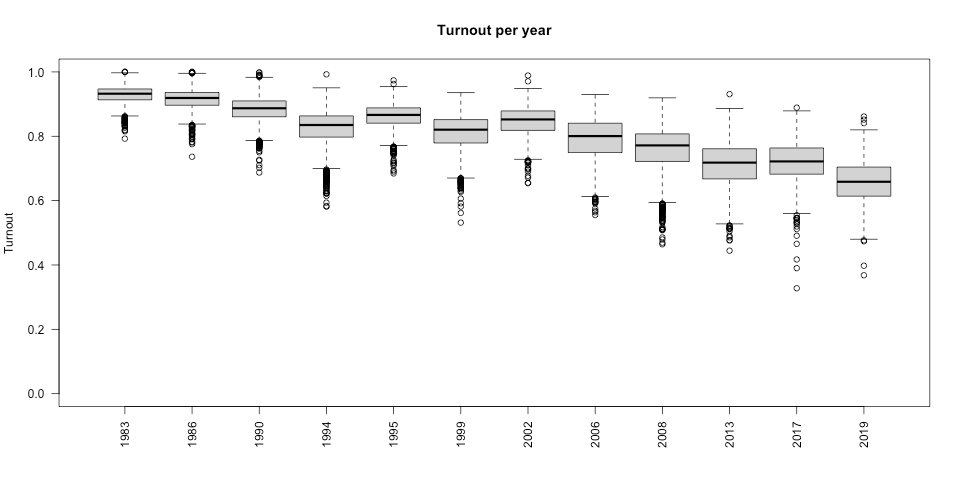
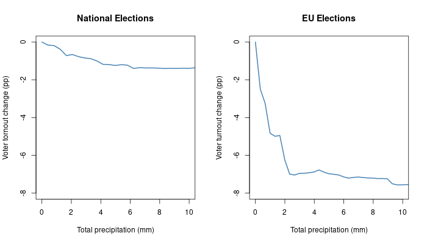

# Rainy Sundays as political threat?

## Introduction

The legitimacy and representativeness of elected officials depend on voter participation, which is crucial for democratic integrity.
A decrease in voter turnout can lead to a gap between the public's preferences and government policy decisions.
Therefore, we aim to investigate whether weather conditions
influence voter participation in Austrian elections.

To explore potential weather effects on Austrian elections, voter turnout data for twelve national council and six European parliament elections held between 1983 and 2019 is analyzed.
This data includes community-level information on the number of eligible voters, active votes, and their division into valid and invalid votes.
The data is publicly available at [wahldatenbank.at](https://www.wahldatenbank.at/).

Election data is combined with weather data, such as precipitation or temperature, obtained from the ERA5 dataset [1] provided by the European Centre for Medium-Range Weather Forecasts.
ERA5 offers climate data on land on a global scale, covering the period from January 1950 to the present, with an hourly temporal resolution and a horizontal resolution of 31km x 31km.
Climate conditions for specific communities in Austria on the day of the election are obtained by interpolating weather data from ERA5 grids to match the exact boundaries of the Austrian communities.
Hourly weather data from ERA5 is aggregated to provide daily measurements during the opening hours of the polls.
The final dataset includes election results from eighteen elections for about 2100 communities (see Fig. 1).

## Identification Strategy 

We begin our analysis by addressing a negative temporal trend in voter turnout (see Fig. 2). This is achieved by subtracting a linear trend from the outcome data.
Once this is achieved, our primary tool of exploration is a random forest model.
This model investigates the connections between various weather conditions (e.g. rainfall, sunshine, wind) and voter turnout in both national and European elections. 
To show a more comprehensive picture, our model also takes into consideration legal and regional differences which could influence turnout.

In order to interpret the results with more clarity, we generate partial dependence plots for the weather variables.
These visualizations help us understand how each weather variable, independently, could affect voter turnout, with all other factors being held constant.
While partial dependence plots are valuable for demonstrating the general effect of a single variable, they do not capture potential interactions between variables.
Hence, they might oversimplify the nuances of the underlying relationships in cases where variables interact each other in complex ways.

To validate the reliability of our findings, we then employ a logistic generalized linear model as a robustness check.

## Results
The random forest analysis indicates a consistent effect of precipitation on both types of elections as shown in the partial dependence plots in Figure 3:

However, the effect of weather on voter participation is notably stronger in EU elections, potentially due to their perceived lower importance [2], rendering voters more susceptible to weather influences.

During national elections, voter turnout decreases by approximately 1.3 percentage points on days with rainfall exceeding 5mm.
Conversely, in EU elections, voter turnout experiences a more substantial reduction of approximately 7 percentage points on rainy days with more than 3mm of rain. 
Further exploration of additional weather variables did not reveal clear effects on voter turnout.

## Conclusion
Our results indicate that rainfall has a negative impact on both national and European parliament elections, with a particularly significant effect on the latter.
According to the results of the random forest analysis, rainy weather is associated with a reduction of up to 2 percentage points in national election turnout and a decrease of up to 7.5 percentage points in EU elections.

This study emphasises the significance of considering weather conditions in election planning and policymaking to enhance the overall fairness and accessibility of elections and provide greater resilience against weather challenges. 
Policymakers could explore alternative voting methods, such as online voting, to promote greater voter engagement and ensure a more democratic electoral process.

## References

[1] Hersbach, H. and others. "ERA5 hourly data on single levels from 1940 to present" (2023). [Link](https://doi.org/10.24381/cds.adbb2d47)

[2] Stockemer, Daniel. "Citizens’ Support for the European Union and Participation in European Parliament Elections" (2012). *European Union Politics*, 13(1), 26-46. [DOI](https://doi.org/10.1177/1465116511419870)
